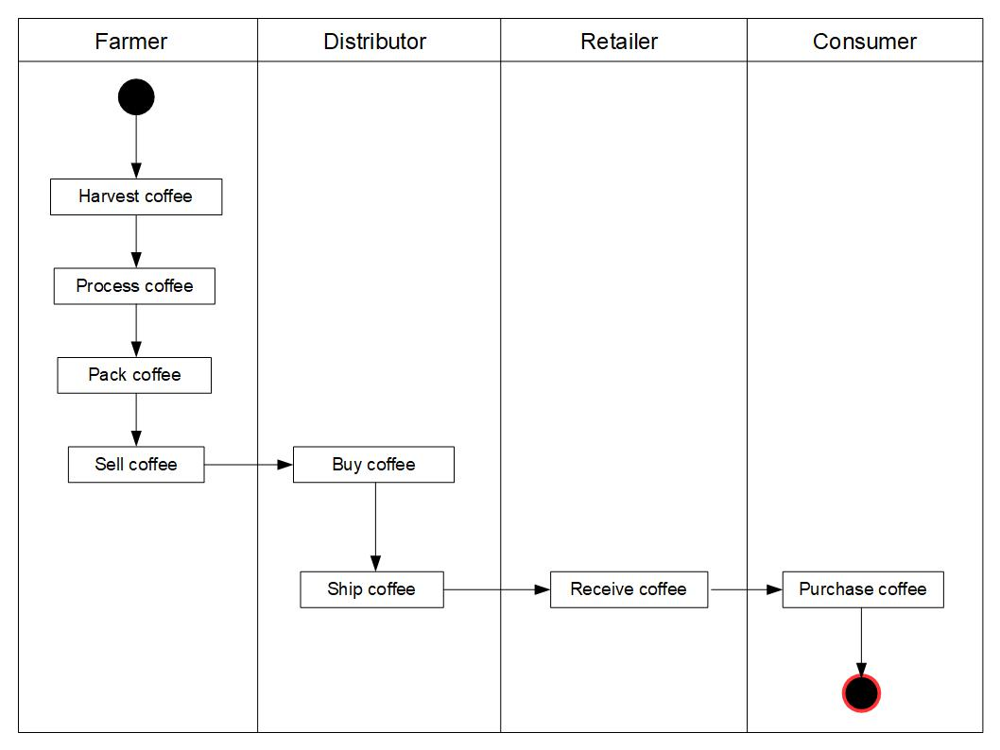
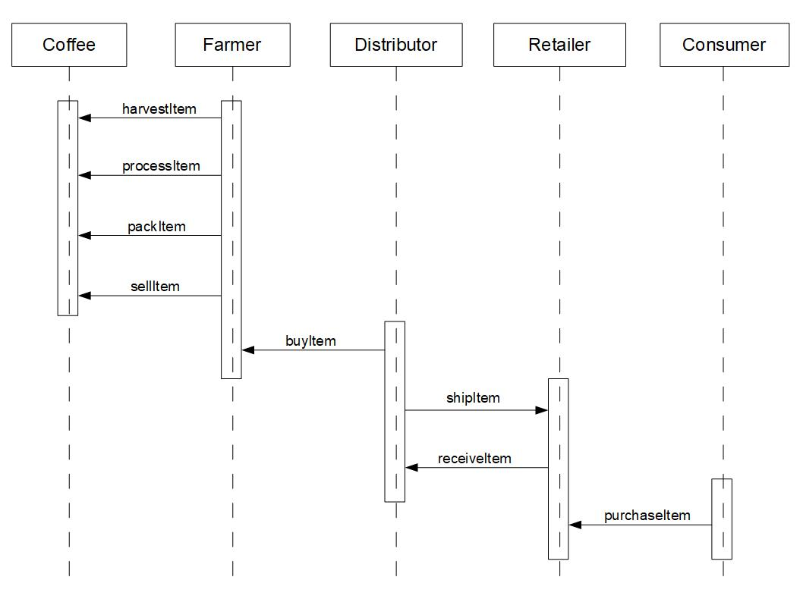
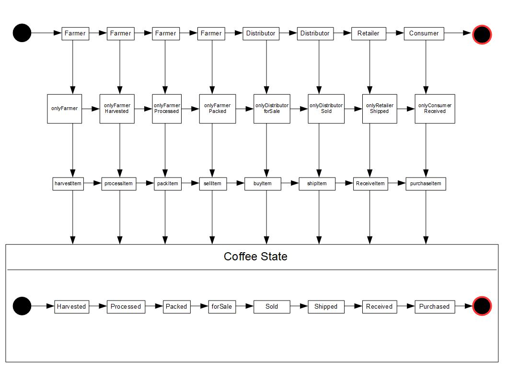
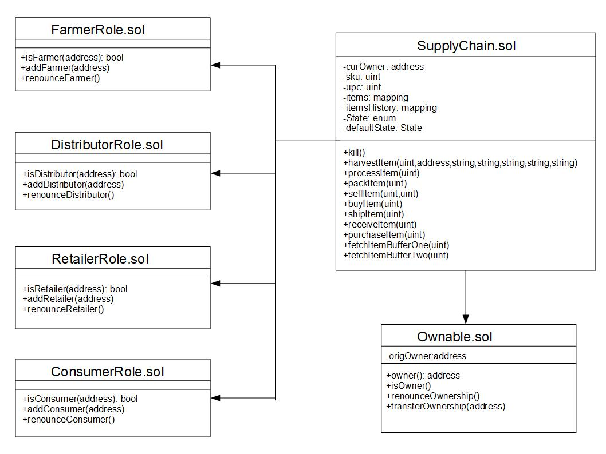

# Supply chain & data auditing

This repository contains an Ethereum DApp that demonstrates a Supply Chain flow between a Seller and Buyer. The user story is similar to any commonly used supply chain process. A Seller can add items to the inventory system stored in the blockchain. A Buyer can purchase such items from the inventory system. Additionally a Seller can mark an item as Shipped, and similarly a Buyer can mark an item as Received.

# Contracts Addresses

The project's contracts have been deployed to Rinkeby:
* Migrations:   
[Transaction](https://rinkeby.etherscan.io/tx/0x147d7f203998a24d4a88b67431649fb9a6693f2be9e3cbb6b240d4c7285ac143)   
[Contract address](https://rinkeby.etherscan.io/address/0xba3d05e18082a463ec68a23e365874894512eed3)  
* FarmerRole:   
[Transaction](https://rinkeby.etherscan.io/tx/0x38524f8934010c82dffcbde93c427b389656f0bf0b0676b5a138e84e085b6ec8)   
[Contract address](https://rinkeby.etherscan.io/address/0x62f0a21935385e948683cb816ae897a9185efa10)  
* DistributorRole:   
[Transaction](https://rinkeby.etherscan.io/tx/0xe46f99b1c2588af46f814f0cd4156a5dd4a964b2ca2a924435b5375fc337c211)   
[Contract address](https://rinkeby.etherscan.io/address/0xbfebe6893678194542ad73cd9f60b58c52636d89)   
* RetailerRole:   
[Transaction](https://rinkeby.etherscan.io/tx/0xfa4f89d6b7951e7bb84e349782bf06719f953634565843128a4a9a00cc83a4d8)   
[Contract address](https://rinkeby.etherscan.io/address/0xd09fc6f2cb38e74ab610cba50b0310e83a446869)   
* ConsumerRole:   
[Transaction](https://rinkeby.etherscan.io/tx/0x04a40cd1d8fa5c15cbc04b36185077da0f88ee9ad196d3b02bc53004fb8995c2)   
[Contract address](https://rinkeby.etherscan.io/address/0xdb1c3ce4e93cd4065fd7cd4d8fc4226fb8833752)   
* SupplyChain:   
[Transaction](https://rinkeby.etherscan.io/tx/0x832b9ffeccbd4d65bd40b0f2272f3182a999367d41fd6300371be597af9c4e67)   
[Contract address](https://rinkeby.etherscan.io/address/0xf3a99781c1309bb508e81bb29c69c371ff4e05bb)   

# UML Diagrams

### Activity Diagram


### Sequence Diagram


### State Diagram


### Class Diagram


# DApp User Interface

The DApp User Interface when running should look like...


## Getting Started

These instructions will get you a copy of the project up and running on your local machine for development and testing purposes. See deployment for notes on how to deploy the project on a live system.

### Prerequisites

Please make sure you've already installed ganache-cli, Truffle and enabled MetaMask extension in your browser.

### Installing

> The starter code is written for **Solidity v0.4.24**. At the time of writing, the current Truffle v5 comes with Solidity v0.5 that requires function *mutability* and *visibility* to be specified (please refer to Solidity [documentation](https://docs.soliditylang.org/en/v0.5.0/050-breaking-changes.html) for more details). To use this starter code, please run `npm i -g truffle@4.1.14` to install Truffle v4 with Solidity v0.4.24. 

A step by step series of examples that tell you have to get a development env running

Clone this repository:

```
git clone https://github.com/udacity/nd1309/tree/master/course-5/project-6
```

Change directory to ```project-6``` folder and install all requisite npm packages (as listed in ```package.json```):

```
cd project-6
npm install
```

Launch Ganache:

```
ganache-cli -m "spirit supply whale amount human item harsh scare congress discover talent hamster"
```

Your terminal should look something like this:


In a separate terminal window, Compile smart contracts:

```
truffle compile
```

Your terminal should look something like this:


This will create the smart contract artifacts in folder ```build\contracts```.

Migrate smart contracts to the locally running blockchain, ganache-cli:

```
truffle migrate
```

Your terminal should look something like this:


Test smart contracts:

```
truffle test
```

All 10 tests should pass.


In a separate terminal window, launch the DApp:

```
npm run dev
```

## Built With

* [Ethereum](https://www.ethereum.org/) - Ethereum is a decentralized platform that runs smart contracts
* [Truffle Framework](http://truffleframework.com/) - Truffle is the most popular development framework for Ethereum with a mission to make your life a whole lot easier.


## Authors

See also the list of [contributors](https://github.com/your/project/contributors.md) who participated in this project.

## Acknowledgments

* Solidity
* Ganache-cli
* Truffle
